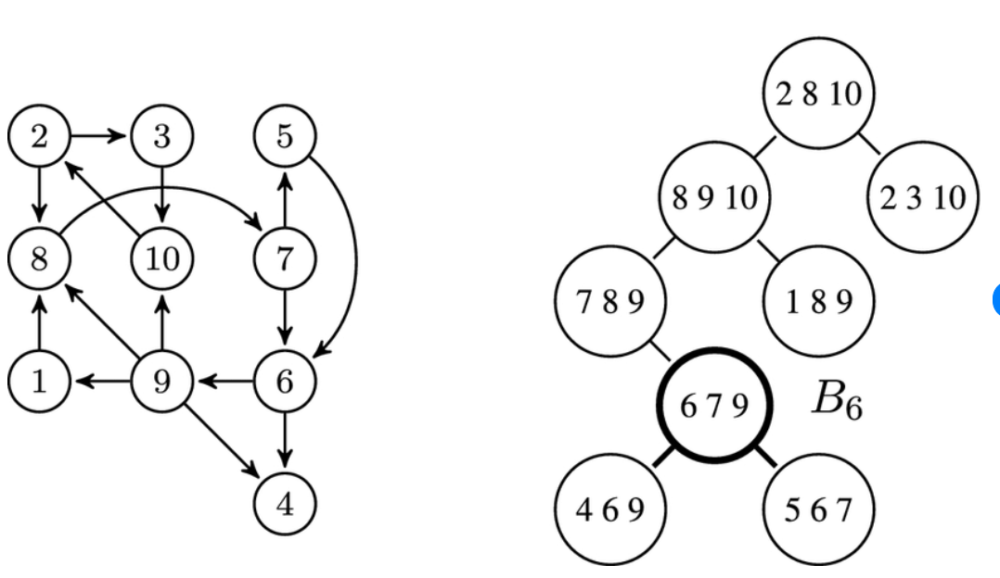

# Maximum Independent Set on Trees

## Introduction

The **Maximum Independent Set (MIS)** problem asks:

> What is the largest set of vertices we can choose so that no two chosen vertices share an edge?

In simpler words, we want to pick as many nodes as possible while ensuring that no selected nodes are neighbors.

---

## Applications

MIS appears in many real-world scenarios:

- Scheduling tasks where conflicting tasks cannot run together  
- Placing Wi-Fi routers or base stations to avoid interference  
- Network design and resource allocation  
- Map labeling and facility placement  
- Bioinformatics (protein interaction networks)

---

## Why is MIS Important?

MIS was one of the original 21 NP-complete problems identified by Karp.

The Maximum Independent Set problem is **NP-hard** on general graphs.

This means:

- No polynomial-time algorithm is known for all graphs  
- A polynomial-time solution would imply $P = NP$  
- It is closely related to Vertex Cover, Clique, and 3-SAT  

However, many NP-hard problems become efficient on restricted graph families.

**Trees are one of the most important such families.**

Because trees have no cycles, they allow elegant and efficient dynamic programming solutions.

---

## Problem Statement

**Input:**  
An undirected tree $T = (V, E)$ with $n$ vertices.

**Output:**  
The size of the largest independent set in $T$.

We root the tree at any arbitrary node (say node 1).  
The result does not depend on the chosen root.

---

# Key Insight

At every node, we have exactly **two choices**:

1. Include this node  
2. Exclude this node  

If we include a node → we cannot include its children.  
If we exclude a node → children are free to choose independently.

This naturally leads to a dynamic programming solution on trees.

---

# DP Formulation

For each node $u$, define:

- $dp[u][0]$ = maximum independent set size in subtree of $u$ **excluding $u$**
- $dp[u][1]$ = maximum independent set size in subtree of $u$ **including $u$**

---

## Recurrence Relations

### Include $u$

$$
dp[u][1] = 1 + \sum_{v \in children(u)} dp[v][0]
$$

### Exclude $u$

$$
dp[u][0] = \sum_{v \in children(u)} \max(dp[v][0], dp[v][1])
$$

---

## Base Case

The base case occurs when we reach a **leaf node** \( u \) in the rooted tree.

A leaf node has no children (except possibly its parent),  
so the subtree rooted at \( u \) contains only the node \( u \) itself.

We consider two possible decisions:

### Case 1: Exclude \( u \)

- We do not include node \( u \) in the independent set.
- Since there are no children to consider,
- No vertices contribute to the independent set in this subtree.

\[
dp[u][0] = 0
\]

---

### Case 2: Include \( u \)

- We include node \( u \) in the independent set.
- This contributes exactly one vertex.
- There are no child conflicts because the node is a leaf.

\[
dp[u][1] = 1
\]

---

Thus, for every leaf node:

\[
dp[u][0] = 0,  dp[u][1] = 1
\]

These values initialize the dynamic programming and allow results to propagate upward during DFS.

## Final Answer

$$
\max(dp[root][0], dp[root][1])
$$

---

# Pseudocode

```text
Global:
    adj[1..n]          // adjacency list
    dp[1..n][0..1]     // dp[u][0] = exclude u
                       // dp[u][1] = include u

procedure DFS(u, parent):

    dp[u][0] ← 0
    dp[u][1] ← 1        // include u itself

    for each v in adj[u]:
        if v ≠ parent then
            DFS(v, u)

            // If u is included, children must be excluded
            dp[u][1] ← dp[u][1] + dp[v][0]

            // If u is excluded, choose best for each child
            dp[u][0] ← dp[u][0] + max(dp[v][0], dp[v][1])


Main:

    read n
    build adjacency list adj

    DFS(1, -1)

    answer ← max(dp[1][0], dp[1][1])
    print answer

```

We use a post-order DFS so that children are computed before the parent.

---

# Example

```
      1
     / \
    2   3
   /     \
  4       5
```

Edges:
- (1,2)
- (1,3)
- (2,4)
- (3,5)

### Leaves

- $dp[4] = (0,1)$
- $dp[5] = (0,1)$

### Node 2

- $dp[2][1] = 1$
- $dp[2][0] = 1$

### Node 3

- $dp[3][1] = 1$
- $dp[3][0] = 1$

### Node 1

If include 1:

$$
dp[1][1] = 1 + 1 + 1 = 3
$$

If exclude 1:

$$
dp[1][0] = 1 + 1 = 2
$$

### Final Answer

$$
\max(2,3) = 3
$$

One maximum independent set is:

$$
\{1,4,5\}
$$

---

# Why This Works (Proof Sketch)

Every independent set in a subtree either:

- includes node $u$, or  
- excludes node $u$

We compute the optimal value for both cases.

Because trees contain no cycles:

- Child subtrees are independent  
- Optimal substructure holds  

Thus taking

$$
\max(dp[u][0], dp[u][1])
$$

gives the correct result.

---

# Complexity Analysis

### Time Complexity

Each node is visited once.

$$
O(n)
$$

### Space Complexity

DP storage:

$$
O(n)
$$

Recursion stack:

$$
O(h)
$$

Worst case: $O(n)$

---

# Advanced Section: Treewidth

Treewidth measures how “tree-like” a graph is.  
Many dynamic programming algorithms that work on trees can be generalized to graphs with small treewidth.

---

## Tree Decomposition



The left side of the figure shows the original graph.  
The right side shows a **tree decomposition** of that graph.

Each circle on the right is called a **bag**, and it contains a subset of vertices from the original graph.

For example:

- The highlighted bag \( B_6 = \{6,7,9\} \)
- Other bags include \( \{4,6,9\} \), \( \{5,6,7\} \), \( \{7,8,9\} \), etc.

These bags are connected in a tree structure.

---

## Formal Definition of Tree Decomposition

A tree decomposition of a graph \( G = (V,E) \) is a tree whose nodes are bags \( X_t ⊆ V \) such that:

1. **Vertex Covering Property**  
   Every vertex in \( V \) appears in at least one bag.

2. **Edge Covering Property**  
   For every edge \( (u,v) in E \),  
   there exists a bag containing both \( u \) and \( v \).

3. **Running Intersection Property**  
   For any vertex \( v \),  
   the bags containing \( v \) form a connected subtree.

In the shown diagram:

- Every edge of the original graph appears together inside some bag.
- All bags containing vertex 9 form a connected region in the decomposition tree.

---

## What is a Bag?

A **bag** \( X_t ⊆ V \) is simply a subset of vertices.

Instead of performing DP on individual vertices (as in trees),  
we perform DP on subsets of vertices inside each bag.

For a bag of size \( k \), we may need to consider up to \( 2^k \) subsets.

---

## Treewidth Definition

If the largest bag in a decomposition has size \( w+1 \), then:

treewidth(G) = w

In the provided example:

- The largest bag contains 3 vertices.
- Therefore, the treewidth of the graph is:

\[
3 - 1 = 2
\]

Examples:

- Trees → treewidth = 1  
- Cycles → treewidth = 2  
- Clique on \( n \) vertices → treewidth = \( n-1 \)

---

## Key Insight: Extending Tree Algorithms

Any divide-and-conquer style dynamic programming algorithm
that works on trees can be generalized to graphs of bounded treewidth.

The only penalty is an exponential factor in the treewidth.

If the treewidth of a graph \( G \) is \( w \), then many problems
(including Maximum Independent Set) can be solved in:

O(2^tw(G) * n)

time and space.

This exponential factor arises because:

- Each bag may contain up to \( w+1 \) vertices.
- We must consider all subsets of the bag.
- The number of subsets is \( 2^{w+1} \).

Thus:

- Trees (tw(G) = 1) → O(n)
- Low treewidth graphs → Fixed Parameter Tractable (FPT)
- Large treewidth → Exponential blowup


---

# Implementation

A complete C++ implementation using DFS-based tree DP
is provided in:

- [`solution.cpp`](solution.cpp)

The implementation runs in **O(n)** time and uses
adjacency lists with post-order traversal.

---

# Related Practice Problems

- [House Robber III (LeetCode 337)](https://leetcode.com/problems/house-robber-iii/)  
  This is exactly the Maximum Independent Set problem on a binary tree.

- [Binary Tree Cameras (LeetCode 968)](https://leetcode.com/problems/binary-tree-cameras/)  
  A tree DP problem with multi-state design.

- Minimum Vertex Cover on Trees

---

# Takeaways

- MIS is NP-hard in general graphs  
- Trees allow linear-time DP  
- Treewidth generalizes this idea  
- MIS is FPT with respect to treewidth  

---

# References

- Kleinberg & Tardos — *Algorithm Design*  
- CLRS — *Introduction to Algorithms*
